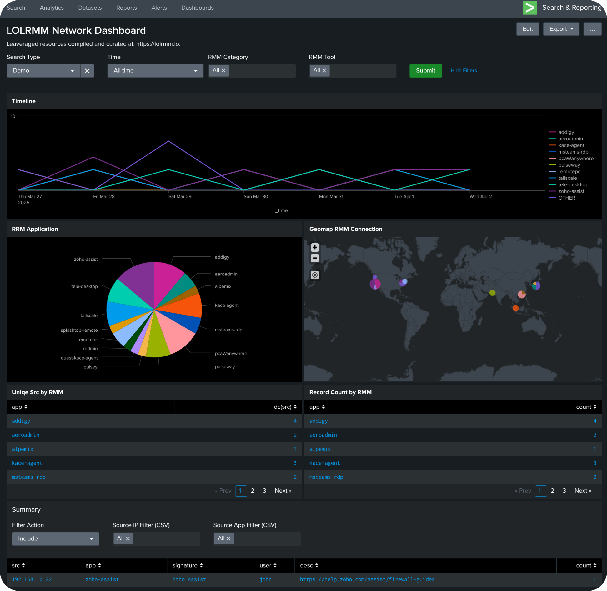

# LOLRMM Detection Resources



## Overview

This repository serves as a comprehensive collection of resources for monitoring, detecting, and analyzing Remote Monitoring and Management (RMM) tools across enterprise environments. While RMM tools are essential for legitimate IT administration, they are increasingly being leveraged by threat actors as part of "Living Off the Land" (LOL) techniques, making their detection and monitoring crucial for security teams.

Currently, the repository focuses on Splunk-based detection and monitoring capabilities, but it is actively expanding to include:
- Multi-SIEM detection rules and dashboards
- API integration scripts for RMM platforms
- Detection engineering guidance
- Threat hunting playbooks
- Incident response procedures

> [!NOTE]  
> All data is compiled and curated from: https://lolrmm.io

> [!IMPORTANT]  
> This project aims to become a central hub for security practitioners dealing with RMM tool detection and analysis across different platforms and tools.

## Components

- **Dashboard**: Interactive visualization of RMM tool usage across your network
- **Scheduled Search**: Creates and maintains a lookup table of RMM detections
- **Multiple Data Source Options**: Flexibility to use Splunk Enterprise Security, PaloAlto firewalls, or custom data sources

## Files

```
├── splunk/
│   ├── dashboards/
│   │   └── lolrmm_network_dashoard.xml   # Main RMM monitoring dashboard
│   ├── searches/
│   │   ├── es-lolrmm_dns_cim_search.spl      # ES-compatible DNS monitoring
│   │   ├── es-lolrmm_network_report.spl      # ES network traffic analysis
│   │   ├── es-lolrrm_dns_search.spl          # ES DNS detection search
│   │   └── non-es-lolrrm_dns_search.spl      # Standard Splunk DNS detection
│   └── demo.csv                              # Sample data for testing
```

## Instructions

This repository provides search and dashboard options for both Splunk Enterprise Security (ES) customers and non-ES Splunk customers.

> [!IMPORTANT]  
> Search files are prefixed with either `es-` or `non-es-` to clearly indicate which environment they are designed for.

### For Splunk Enterprise Security (ES) Customers

ES customers can leverage the data model accelerations and additional context provided by Splunk Enterprise Security:

1. Use the searches prefixed with `es-` which utilize the Network_Traffic data model
2. The dashboard automatically detects if you're using ES and enables appropriate features
3. ES-specific correlation searches can be scheduled to trigger notable events

### For Non-ES Splunk Customers

If you don't have Splunk Enterprise Security, you can still use these resources:

1. Use the searches prefixed with `non-es-` which are designed to work with standard Splunk indexes
2. Configure the dashboard to use PaloAlto or raw network data sources
3. Create scheduled searches to populate the lookup tables needed by the dashboard

## Setup Instructions

### Option 1: Scheduled Search with KV Store (Recommended for Large Enterprises)

> [!TIP]
> This approach is ideal for large enterprises as it reduces query load during dashboard viewing, provides consistent historical data, and enables faster dashboard loading times.

1. Install the search `lolrm_network_report.spl` as a scheduled search
2. Configure the search to run at your preferred interval (e.g., daily)
3. The search will output results to a KV store lookup table named `lolrmm.csv`
4. Import the dashboard XML and select "LOLRMM Network Report" as the data source

### Option 2: Direct PaloAlto Firewall Data

1. Import the dashboard XML
2. Select "PaloAlto Index" as the data source
3. Ensure your PaloAlto logs are being ingested with the sourcetype `pan:traffic`

### Option 3: Splunk Enterprise Security Data Model

1. Import the dashboard XML
2. Select "Splunk ES" as the data source
3. Ensure your Network_Traffic data model is properly populated

> [!IMPORTANT]  
> Custom macros `detect_remote_access_software_usage_traffic_filter` and `remote_access_software_usage_exceptions` must be configured for proper dashboard functionality.

## Dashboard Features

- **Timeline View**: Visualize RMM tool usage over time
- **Application Distribution**: See which RMM tools are most prevalent
- **Geographic Map**: View global distribution of RMM connections
- **Source Analysis**: Identify hosts using RMM tools
- **Filtering Options**: Drill down by tool type, category, time range, and more

## Use Cases

- Identify unauthorized RMM tool usage
- Monitor legitimate RMM tool activity
- Detect potential lateral movement or command and control activity
- Validate security policies around remote access tools

## Requirements

- Splunk Enterprise or Splunk Cloud
- For ES option: Network_Traffic data model
- For PaloAlto option: PaloAlto firewall logs with sourcetype `pan:traffic`

> [!WARNING]  
> RMM tools are frequently used in legitimate IT operations. Always verify findings before taking action to avoid disrupting business operations.

> [!CAUTION]
> This dashboard identifies network traffic patterns associated with RMM tools but does not automatically distinguish between legitimate and malicious usage.

## License

[Include license information here]