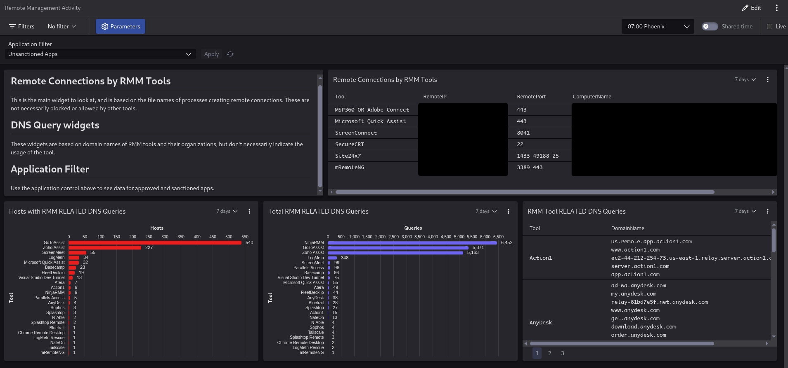

### CrowdStrike

#### CrowdStrike Setup Instructions

1.  **Upload Lookup Files:**
    *   Navigate to `Next-Gen SIEM -> Log management -> Lookup files` in your Falcon console.
    *   Upload `crowdstrike/RMM-Artifacts.csv`.
    *   Upload `crowdstrike/RMM_Domain_Artifacts.csv`.

2.  **Import Dashboard:**
    *   Navigate to `Next-Gen SIEM -> Log management -> Dashboards`.
    *   Click `Create dashboard` and select `Import`.
    *   Upload the dashboard template file `crowdstrike/RemoteManagementActivity.yaml`

3.  **Configure Dashboard Application Filter:**
    *   Once imported, open the newly created dashboard.
    *   Click `Edit` (usually in the top right).
    *   Locate the "Application Filter" parameter/input (top left).
    *   Replace the default value with a pipe-separated (`|`) list of your *approved* RMM tools (e.g., `ApprovedTool1|ApprovedTool2|ApprovedTool3`). This helps filter out known legitimate activity from the main views. *Note: Remote Desktop related terms will be filtered by default, review the dashboard query if needed.*
    *   Save the dashboard changes.

#### CrowdStrike Requirements

-   CrowdStrike Falcon Platform.
-   Access to Next-Gen SIEM / LogScale module.
-   Permissions to upload Lookup files and create/edit Dashboards.

