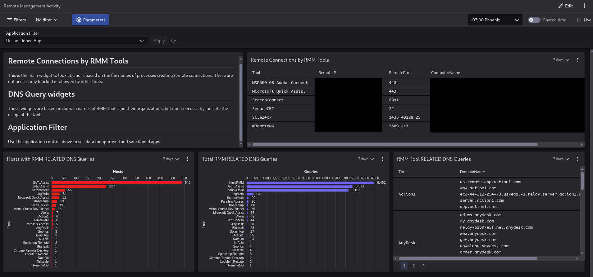

# CrowdStrike LOLRMM Detection Resources

This directory contains resources for detecting RMM tools using the CrowdStrike Falcon platform, specifically focused on Next-Gen SIEM (LogScale) dashboards and lookups.

> [!NOTE]
> For automated API-driven IOC synchronization, see the [crowdstrike_ioc/](../crowdstrike_ioc/README.md) directory.

## Contents

- **`RemoteManagementActivity.yaml`**: Dashboard template for CrowdStrike Next-Gen SIEM.
- **`generate_artifacts.py`**: Script to fetch the latest RMM data from [lolrmm.io](https://lolrmm.io) and create local CSV lookups.
- **`RMM-Artifacts.csv`**: Pre-generated lookup for RMM process and file artifacts.
- **`RMM_Domain_Artifacts.csv`**: Pre-generated lookup for RMM domain and network artifacts.

## Setup Instructions

### 1. Generate & Upload Lookup Files

1. Run the generation script to ensure you have the latest data:
   ```bash
   python3 generate_artifacts.py
   ```
2. In your Falcon console, navigate to `Next-Gen SIEM -> Log management -> Lookup files`.
3. Upload `RMM-Artifacts.csv` and `RMM_Domain_Artifacts.csv`.

### 2. Import Dashboard

1. Navigate to `Next-Gen SIEM -> Log management -> Dashboards`.
2. Click `Create dashboard` and select `Import`.
3. Upload the `RemoteManagementActivity.yaml` file.

### 3. Configure Application Filters

1. Open the imported dashboard and click **Edit**.
2. Locate the **Application Filter** input at the top.
3. Add your *approved* RMM tools as a pipe-separated list (e.g., `ApprovedTool1|ApprovedTool2`).
4. Save the changes.

## Requirements

- CrowdStrike Falcon Platform.
- Next-Gen SIEM / LogScale module access.
- Permissions to manage Lookups and Dashboards.


